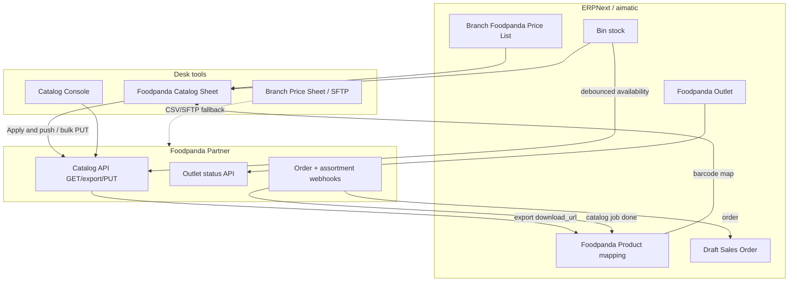

# Foodpanda synchronized outlet

**End goal:** each enabled branch outlet stays in sync with Foodpanda so that
portal prices, stock/availability, active/inactive, and (when enabled) inbound
orders match ERPNext without manual portal uploads.

**Primary site for Partner API work:** `siezal` (`https://siezal.aimatic.tech`).  
**Code:** `aimatic/foodpanda_integration/` (Partner API) + `aimatic/shelf_pricing/`
(local Foodpanda Price Lists only).

This document is the operational status of that goal — what is built, what is
proven on siezal, and what is still required for a fully synchronized outlet.

---

## 1. What “synchronized outlet” means

For one `Foodpanda Outlet` (one Branch ↔ one Foodpanda `vendor_id`):

| Concern | Source of truth in ERPNext | Pushed / pulled to Foodpanda |
|---|---|---|
| Selling price on Foodpanda | Branch **Foodpanda Price List** | Partner catalog PUT `price` |
| Stock / availability | Branch finished-goods Bin | Partner catalog PUT `quantity` + `active` |
| Portal active / inactive | `Foodpanda Product.portal_active` (+ stock/sales rules) | Partner catalog PUT `active` |
| Which ERPNext Item maps to which portal SKU | Barcode match → `Foodpanda Product.foodpanda_product_id` | Mapping only (no create unless beta creation is on) |
| Outlet open / closed / busy | Desk action on outlet | Partner outlet status API |
| Inbound orders | Webhook → draft Sales Order | Order webhook + reject on failure |

**Not the same as sync:** Branch Price Sheet CSV / SFTP upload is a **manual or
scheduled file fallback**. It updates Foodpanda via their file channel, not the
Partner catalog API. Prefer Partner sync when credentials and mapping are ready.

---

## 2. How the integration works

### 2.1 Configuration

1. **Foodpanda Settings** (site-wide): OAuth client, default chain ID, API host,
   webhook secret, optional `allow_product_creation`, shared SFTP
   host/user/password/prefix.
2. **Foodpanda Outlet** (per branch): `chain_id` (each branch can be a separate
   Foodpanda chain), `vendor_id`, `catalog_sync_enabled`,
   `order_ingestion_enabled`, SFTP enable/schedule, optional auto-map on catalog import.
3. **Foodpanda Category Map**: Item Group → Foodpanda category (needed only to
   **create** new portal products; not required for update-only sync of an
   existing catalog).
4. Webhook URLs (from Desk / API helper) must be registered in Foodpanda Vendor
   Portal with the same Authorization secret. Assortment callbacks use
   `foodpanda_catalog_webhook`; orders use `foodpanda_order_webhook`.
   `validate_foodpanda_webhook_auth` must accept Bearer secrets before Frappe’s
   OAuth gate returns 401.

### 2.2 Catalog sync loop (steady state)

1. **Import assortment** — `POST /catalog/export` → webhook with `download_url`
   → CSV stored on `Foodpanda Catalog Job` (~full store list).
2. **Map by barcode** — never by Item Code. Leading-zero barcode variants are
   tried. Sets `Foodpanda Product.foodpanda_product_id` = remote SKU.
3. **Maintain prices locally** — Purchase Receipt Foodpanda apply, Branch Price
   Sheet, or Catalog Sheet editable “Our Foodpanda Price”.
4. **Push** — bulk or per-item PUT: `sku`, `price`, `quantity` (integer floor),
   `active`, digit-only barcode ≤14 chars (omit invalid barcodes).
5. **Ongoing stock** — Bin `on_update` debounces (~30s) then pushes availability
   for **mapped** products only.
6. **Catalog Sheet “Apply & push”** — for Match Ready rows: link SKU → save
   prices (seed remote if missing) → save Portal Active → PUT those items.

Match statuses on the sheet:

| Status | Meaning |
|---|---|
| Linked | Barcode matched and `foodpanda_product_id` = remote SKU |
| Match Ready | Barcode matched one Item; SKU not stored yet — use Apply & push |
| Not Linked / No Barcode / Ambiguous | Cannot safely auto-map |

### 2.3 Orders

When `order_ingestion_enabled` is on, Foodpanda posts the order webhook →
`Foodpanda Order Log` is committed first → draft Sales Order under customer
**Foodpanda** → failure rejects the Foodpanda order and leaves an auditable log.
Line items resolve via barcode mapping / product SKU, not Item Code.

### 2.4 Outlet status

Desk can push/pull Open / Closed / Busy for the outlet’s `vendor_id`. This is
independent of catalog mapping.

### 2.5 Ownership split

| Work | Module / skill |
|---|---|
| Partner API, webhooks, catalog jobs, orders | `foodpanda-integration` |
| Branch Foodpanda Price List create/update from PR / Branch Price Sheet | `shelf-pricing` |
| SFTP CSV upload to Foodpanda | Foodpanda Settings (host/user/password) + Outlet (enable/filename vendor_id); `price_export.foodpanda_sftp` |

---

## 3. What is done

### Platform (code)

- [x] OAuth client-credentials client with token cache and 401 invalidate
- [x] DocTypes: Settings, Outlet, Product, Category Map, Catalog Job, Order Log
- [x] Catalog export download + CSV parse + optional auto-map
- [x] Barcode mapping (variants, ambiguous/unmatched reporting Excel)
- [x] Bulk PUT price/stock in batches of 50; content-hash skip when unchanged
- [x] Job callback handling (promote pending hash / mark Failed + item feedback)
- [x] Debounced Bin → availability sync for mapped items
- [x] Outlet status push/pull
- [x] Order webhook → draft SO + reject on failure (idempotent on order id)
- [x] Webhook auth hook for Bearer webhook secret
- [x] Catalog Console page (English): update prices & stock, refresh links
- [x] **Foodpanda Catalog Sheet** report: Match Ready / Linked grid, edit price,
      Portal Active, Save prices, Apply & push, bulk push, refresh links
- [x] Local Foodpanda prices via shelf-pricing + Branch Price Sheet (+ SFTP guide)

### Proven on siezal (Ghouri Town VIP, vendor `rg26`) — snapshot Aug 2026

- [x] Partner credentials and catalog sync enabled
- [x] Catalog export webhook 200; ~**18,495** remote SKUs imported
- [x] ~**5,553** mapped Foodpanda Products (barcode match)
- [x] Bulk push: ~**5,503** Synced, ~**51** Failed, few Pending
- [x] Catalog Sheet live with Match Ready apply path (`portal_active` column)
- [x] Order ingestion flag on (no live order logs yet on siezal at last check)
- [x] `allow_product_creation` currently on in Settings (use carefully)

### Desk entry points

- Aimatic → Foodpanda workspace / sidebar
- Report: **Foodpanda Catalog Sheet**
- Page: **foodpanda-catalog-console**
- DocType: **Foodpanda Outlet** (per branch)
- Related: **Branch Price Sheet** (local prices / CSV / SFTP)

---

## 4. What is left (to reach a fully synchronized outlet)

Ordered by impact toward the end goal.

### A. Catalog quality (same outlet)

- [ ] Clear or fix the ~**51 Failed** products (often bad price / barcode /
      batch HTTP 400 — one bad SKU can fail a whole batch of 50)
- [ ] Reduce **Not Linked** (~9.7k) and **No Barcode** (~3.2k) where business
      wants them on Foodpanda: fix ERPNext barcodes, or accept they stay portal-only
- [ ] Drive remaining **Match Ready** to Linked via Catalog Sheet Apply & push
- [ ] Decide policy for portal SKUs with no ERPNext barcode (never auto-map)

### B. Continuous sync (operations)

- [ ] Standard schedule: periodic catalog refresh (export + map) after large
      assortment changes on the portal
- [ ] Confirm Bin-driven availability is firing in production workers after
      stock moves / POS (gunicorn `--preload` needs web restart when hooks change)
- [ ] Outlet status: set Open/Closed/Busy from Desk as part of store open/close
      (status still **Unknown** on Ghouri Town VIP until first pull/push)
- [ ] Monitor Failed / Pending on Catalog Sheet or outlet dashboard regularly

### C. Orders (full closed loop)

- [ ] End-to-end test: real or Foodpanda test order → draft SO → stock/price check
- [ ] Confirm reject path and statuses Foodpanda accepts (no unsupported
      `ACCEPTED`)
- [ ] Fulfillment outbound statuses (`READY_FOR_PICKUP` / `DISPATCHED`) if the
      business needs them from ERPNext (code exists; confirm live usage)
- [ ] Accounting handoff from draft SO / Foodpanda receivable (align with POS
      Food Panda credit-sale process documented in the app guide)

### D. New products (optional)

- [ ] Populate **Foodpanda Category Map** for Item Groups before relying on
      Partner **create** (POST) for new induction
- [ ] Keep `allow_product_creation` off unless induction via API is approved;
      default path remains map-existing + PUT only

### E. Multi-outlet / production

- [ ] Repeat enablement per branch: Outlet + vendor_id + Foodpanda Price List +
      catalog import + map + first bulk push
- [ ] Promote proven flow from siezal to production sites only with backup,
      explicit approval, and rollback (see bench-ops)
- [ ] Retire or demote SFTP/CSV as primary once Partner sync is trusted per outlet

### F. Hardening / polish

- [ ] Shrink blast radius of bulk PUT failures (smaller batches or isolate
      known-bad SKUs)
- [ ] Finish/repair unrelated migrate patch noise on siezal if full `bench migrate`
      must stay green (`setup_price_check_access` Workspace issue seen during migrate)
- [ ] Automated regression coverage for Catalog Sheet apply + portal_active

---

## 5. Recommended operating procedure (one synchronized outlet)

1. **Settings** — Foodpanda Settings enabled; webhooks registered; host_name
   correct for absolute webhook URLs.
2. **Outlet** — Branch linked, `vendor_id` set, catalog sync on, auto-map on.
3. **Prices** — Branch Foodpanda Price List populated (PR apply and/or Branch
   Price Sheet / Catalog Sheet).
4. **Import** — Refresh product links (export + map) from Catalog Sheet or Console.
5. **Link** — Filter Match Ready → review prices / Portal Active →
   **Apply & push to Foodpanda**.
6. **Steady** — Use **Update prices & stock** after large local price changes;
   rely on Bin debounce for day-to-day stock; re-import when the portal
   assortment changes a lot.
7. **Orders** — Turn on order ingestion only after catalog mapping is healthy;
   watch Foodpanda Order Log.
8. **Status** — Pull then push outlet Open at store open if Foodpanda should
   follow store hours from ERPNext.

---

## 6. Key invariants (do not break)

1. Match and order lines by **barcode / mapped Foodpanda SKU**, never assume
   Item Code equals portal SKU.
2. Order webhook: commit **Foodpanda Order Log** before the Sales Order
   savepoint so failures remain auditable.
3. Catalog pushes are **content-hash** gated; promote hash only after a
   successful job callback.
4. Never put client secrets, webhook secrets, or tokens in code, fixtures,
   logs, or docs.
5. Local Foodpanda Price Lists never call the Partner API by themselves —
   pushing is always an explicit catalog sync step.

---

## 7. Related docs

- Roman Urdu SFTP/CSV fallback:
  [`foodpanda-sftp-kpo-guide-roman.md`](foodpanda-sftp-kpo-guide-roman.md)
- App overview (pricing + Foodpanda price list behaviour):
  [`README.md`](README.md) — section *Selling prices: branch pricing, MRP, and Foodpanda*
- Agent skill (gotchas): bench `.claude/skills/foodpanda-integration/SKILL.md`
- Module router notes: `aimatic/foodpanda_integration/CLAUDE.md`
